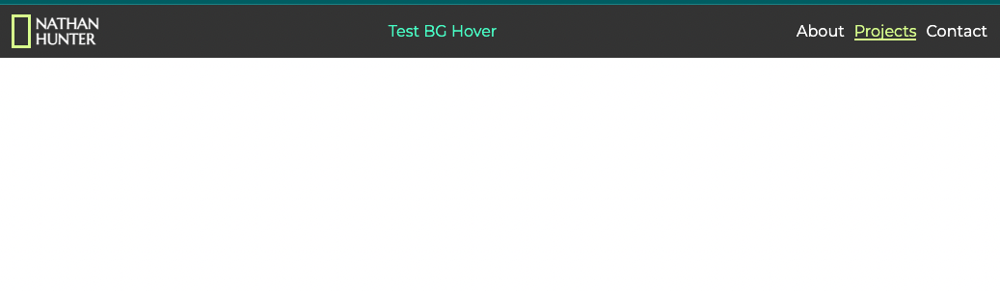

# About today's

## What I "built"

- A navbar for a portfolio site.

 {#identifier .imgBorder}

## What inspired?

- [National Geographic's](https://www.nationalgeographic.com/) site, kind of

## What features are kinda cool that I did?

- A simple logo from a div
- Animated hovering

## What was tricky that I did/learned?

- How to animate a bottom border.
- `div` + `height` stuff

## What did I hope to get to but didn't?

- Animating background color when hovering.

## What did I spend useless time on?

- Fonts?

## Do I feel like this is done?

- No way Jose.

## What should I research more?

- `position` properties.
- Animating/transitioning in general.
- `@keyframes`

## What sources did I use?

1. https://www.nationalgeographic.com/
2. https://stackoverflow.com/questions/29865832/border-bottom-from-left-to-right
3. https://codepen.io/yochans/pen/GRNoLbv
